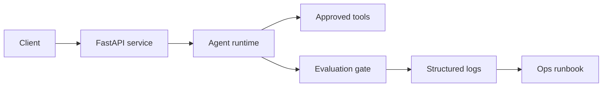

# Agentic MLOps Foundry

Production template for deploying agentic AI services with API boundaries, evaluation gates, CI, Docker and operational runbooks.

This repository demonstrates the engineering surface a CTO expects around AI agents: not only prompts, but testability, deployment, monitoring hooks and rollback-friendly behavior.

## Architecture



## What It Includes

- FastAPI service with health and agent run endpoints.
- Deterministic agent runtime for local testing.
- Evaluation gate that blocks low-confidence responses.
- Dockerfile for containerized deployment.
- GitHub Actions CI with tests.
- Architecture decision record and deployment runbook.

## Quick Start

```bash
python -m venv .venv
source .venv/bin/activate
pip install -e ".[dev]"
uvicorn agentic_mlops_foundry.api:app --reload
pytest
```

## API Example

```bash
curl -X POST http://localhost:8000/agent/run \
  -H "content-type: application/json" \
  -d '{"task":"summarize deployment risks for an agent service"}'
```

## Production Notes

- Replace the deterministic runtime with a model provider behind the same interface.
- Add OpenTelemetry exporters for traces and metrics.
- Store eval results as release artifacts.
- Require human approval before tool scopes expand.

